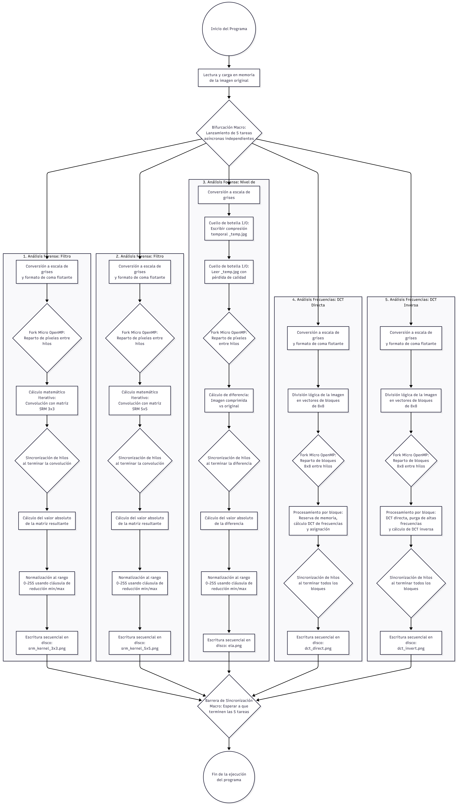

# Práctica 4: Análisis Forense de Manipulación de Imágenes Digitales

Repositorio para la Práctica 4 de la asignatura Computación de Alto Rendimiento (CAR). El objetivo de este proyecto es paralelizar un algoritmo secuencial de detección de manipulación de imágenes (análisis de ruido SRM, análisis de compresión ELA y análisis de frecuencias DCT) utilizando OpenMP y programación asíncrona (`std::async`) en C++.

## Autores
* Carlos Salas Alarcón
* José Francisco Hurtado Valero

## Estructura del Repositorio

El proyecto se divide en diferentes versiones experimentales para analizar el impacto y las ganancias de rendimiento de diferentes enfoques de paralelización:

* **`/base`**: Código secuencial original sin paralelizar.
* **`/suboptimo`**: Implementación con una granularidad ineficiente y evaluación asíncrona perezosa (`std::launch::deferred`).
* **`/optimo_async`**: Implementación híbrida óptima utilizando `std::async` para la orquestación a nivel macro-arquitectónico y OpenMP para los bucles espaciales.
* **`/optimo_omp`**: Implementación alternativa utilizando tareas dinámicas de OpenMP (`#pragma omp task`) en lugar de `std::async`.
* **`/hiperoptimizado`**: Versión sobre-paralelizada (anidamiento extremo) diseñada para forzar y analizar el colapso por *overhead* del sistema.

## Dependencias

El proyecto utiliza las librerías `libjpeg` y `libpng` para el procesamiento de imágenes. En los equipos del laboratorio ya están instaladas. Para compilar en un equipo propio (Linux), instala las dependencias con:

```bash
sudo apt update
sudo apt install libpng-dev libjpeg-dev
```

## Compilación

El proyecto utiliza CMake para gestionar la construcción de los ejecutables. Los archivos `CMakeLists.txt` incluyen automáticamente el flag `-fopenmp`.

Para compilar cualquiera de las versiones, sitúate en la carpeta correspondiente y ejecuta:

```bash
# 1. Configurar el entorno de construcción con CMake
cmake -S . -B ./build

# 2. Entrar en la carpeta generada
cd build

# 3. Construir el ejecutable
make
```

## Ejecución

El programa procesa imágenes en formato PNG o JPG que deben ser cuadradas. Tras compilar, ejecuta el programa desde la carpeta `build` pasando la ruta de la imagen como argumento:

```bash
./detect <ruta_a_la_imagen>
```

*Ejemplo:*
```bash
./detect ../imagenes/imagen_prueba.png
```

El programa generará varias imágenes de salida en el mismo directorio de ejecución, mostrando los resultados de los distintos filtros (SRM 3x3, SRM 5x5, ELA, DCT Directa, DCT Inversa).

*** 
## Diagrama de Dependencias

<div align="left">
  <picture>
    
  </picture>
</div>